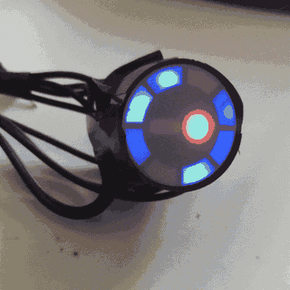
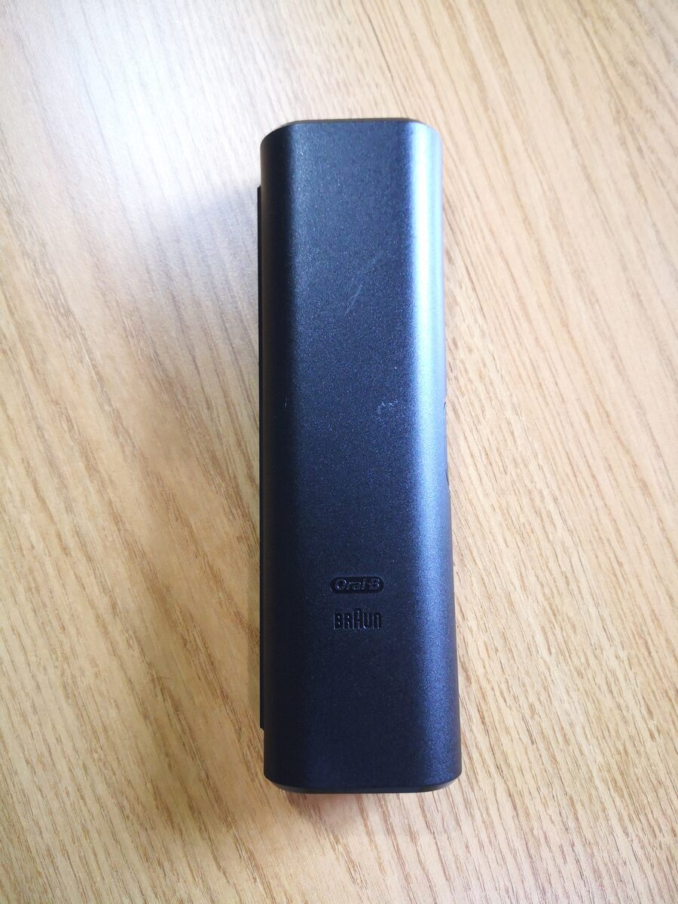
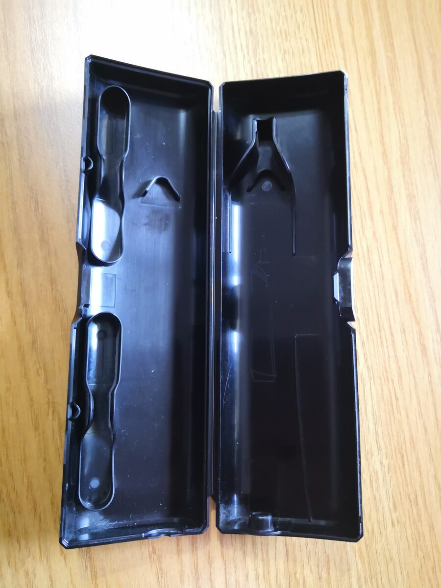
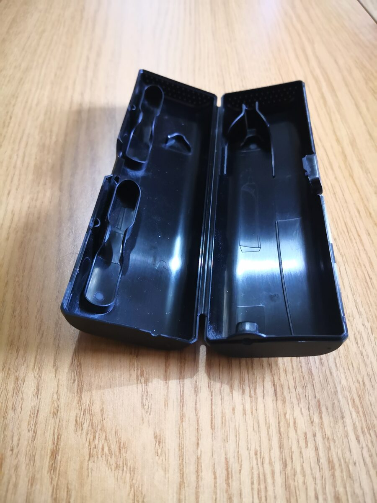

# Borg Costume

MicroPython firmware for a light-up Star Trek Borg costume, running on a Raspberry Pi Pico.

**Note**: Claude's involvement in this repo was purely to check the files over for anything I shouldn't be uploading, writing the readme, and pushing it up to Github. The core code was written by me (following a couple of tutorials!) back in 2022.

The Pico drives an animated LED eyepiece, a servo that "scans" the room at random, and an ultrasonic sensor that locks the scanner forward and lights a red centre LED when someone gets close. A small six-button keypad hidden in the costume controls brightness, eyepiece modes, the scanner and a battery check.

## Features

- **Eyepiece ring**: four LEDs chase around the eyepiece, with a fading trail behind the lead LED. There are four modes: fade, no fade, all on and all off.
- **Proximity lock**: an HC-SR04 ultrasonic sensor checks once a second. If something is closer than 50 cm, the servo centres and the red centre LED comes on.
- **Scanning servo**: when nothing is close, the servo swings to a random position every 750 ms.
- **Activity flicker**: the Pico's onboard LED flickers at random, like a hard-drive activity light.
- **Battery check**: reads the LiPo voltage and shows the charge on the eyepiece ring (1–4 LEDs), then blinks the onboard LED 1–4 times to confirm.
- **Dual core**: the eyepiece and servo run on core 1, while the keypad, sensor and flicker run on core 0.

## Hardware

- Raspberry Pi Pico running MicroPython
- LiPo battery, with its voltage read from VSYS
- Eyepiece LED ring - the one I used was scavenged from a Sky HD box, but something similar will work, or build your own using a ring of 4 LED plus 1 centre LED
- Hobby servo
- HC-SR04 ultrasonic distance sensor
- 3×2 button matrix breakout - also scavenged from a Sky HD box

### Pin map

| Function | GPIO |
|---|---|
| Eyepiece LED 1 / 2 / 3 / 4 | 18 / 19 / 21 / 20 |
| Eyepiece centre LED | 17 |
| Servo signal | 22 |
| Ultrasonic trigger / echo / power | 3 / 2 / 4 |
| Keypad rows | 11, 10, 13 |
| Keypad columns | 14, 15 |
| Onboard LED (activity flicker) | 25 |
| Battery voltage (VSYS via ADC) | 29 |
| USB/charging sense | 24 |

## Keypad controls

| Button | Action |
|---|---|
| 1 | Battery check |
| 2 | Cycle LED brightness (3 levels) |
| 3 | Cycle eyepiece mode (fade → no fade → all on → off) |
| 4 | Toggle servo scanning on/off |
| 5, 6 | Unused |

## Installation

1. Flash MicroPython onto the Pico.
2. Copy `main.py` to the Pico, for example with Thonny or `mpremote cp main.py :main.py`. The Pico runs `main.py` automatically at power-on.

`buttontest.py` is a small diagnostic script that prints the keypad row states in a loop. Run it from Thonny to check the keypad wiring.

## Build photos

The Oral-B travel case used in the build:

  
  
  

## Known issues

- `buttonRead` sets `runCircle = False` without declaring it `global`, so it has no effect. This is harmless in practice, because `batteryCheck` holds the eyepiece lock while it runs.
- `batteryAutoCheck` (lowering brightness as the battery drains) is written but its timer is commented out. If enabled, it would also need to call `brightSet()`, and it uses levels up to 5 while button 2 only cycles 1–3.
- `distanceCheck` busy-waits on the echo pin inside a timer callback. If the sensor is disconnected or never responds, it can hang or raise a `NameError`.

## History

The git history holds each iteration of the script, committed with its original 2022 date:

1. First draft: the overall structure, which doesn't run yet
2. Working timers and eyepiece modes, with the distance sensor simulated
3. Real keypad and ultrasonic sensor, plus new pin assignments and `buttontest.py`
4. Keypad scan fixed, plus onboard LED feedback for the battery check

## License

[MIT](LICENSE) © 2022 Chris Hearn
